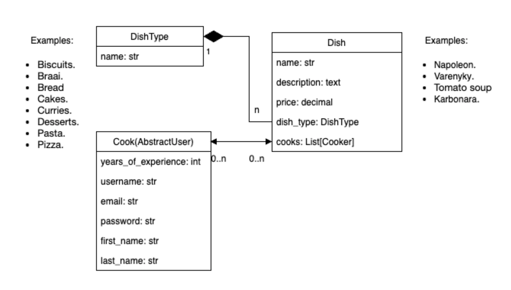

# Kitchen-in-a-restaurant

## Data structure:


## Installation:

## 1.Clone the repository:

  ```https://github.com/MykytaKop/Kitchen-in-a-restaurant.git```
## 2.Create a virtual environment and activate it:

 ```python -m venv .venv``` ```.venv\Scripts\activate (on Windows)``` ```source .venv/bin/activate (on macOS) ```
## 3.Install the project dependencies:

 ```pip install -r requirements.txt```
## 4.Create a database and migrate the models:

 ```python manage.py migrate```
## 5.Load data from dump file:

  ```python manage.py loaddata dump.json```
## 6.Create a superuser or use existing:

 ```python manage.py createsuperuser```
### Or use existing:
#### login: owner
#### password: SuperPassword12345
## 7.Start the server:

  ```python manage.py runserver```
  

## Link to deployed project:


 ```https://kitchen-in-a-restaurant.onrender.com```
